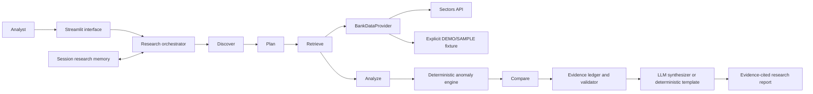

# NUSA Intelligence

**AI research agent for unusual financial changes in Indonesian listed banks.**

NUSA is a Track 01 prototype built around bounded bank discovery, deterministic
financial analysis, source-backed evidence, and a custom tool-routed research
agent. The interface defaults to clearly labeled DEMO/SAMPLE data. Direct live
Companies Screener access remains unresolved; see [Limitations](#limitations).

## Problem

Analysts need to find unusual changes across a relevant peer group, investigate
the underlying financial metrics, and understand why a company was flagged.
Manually screening companies and reconciling periods, peer baselines, and source
records is slow. A fluent AI summary without verifiable evidence can also make
unsupported financial claims.

## Solution

NUSA provides an IDX banking research workflow that ranks unusual annual
financial changes where adequate data is available, investigates a selected
company, compares the selected metric with peers, and presents its evidence and
limitations. Deterministic Python analytics calculate the numbers; the optional
LLM only helps interpret unresolved wording and explain validated evidence.

## Why NUSA

- Discovery is limited to a defined banking universe rather than claiming to
  continuously scan every IDX company.
- Rankings are explainable: the metric, period, change, peer median, peer count,
  and deviation can be traced in the evidence ledger.
- The orchestration and allowed tools are implemented in the project, rather
  than delegated to a prompt-only chatbot.
- Missing coverage stays missing. Demo data is visibly labeled and is never
  presented as current Sectors market data.

## Track 01 Fit

NUSA targets **AI Agents & Assistants (Track 01)**. Its agent has bounded intent
resolution, structured planning, an explicit safe-tool registry/router,
deterministic analysis, evidence validation, session-level structured memory,
and an optional LLM synthesis layer. The model does not execute generated code
or originate financial values. A deterministic report template remains
available when no LLM provider is configured.

## Architecture



The product flow is:

**Discover → Plan → Retrieve → Analyze → Compare → Verify → Explain**

The same provider and analytics interfaces are used by the orchestration layer;
the UI does not duplicate financial calculations.

## Custom Agent Orchestration

The Python orchestrator supports `DISCOVER`, `INVESTIGATE`, and `COMPARE`.
Deterministic parsing and fixed plan templates are used first. If request
wording cannot be resolved, an optional model may propose a structured plan;
the plan must still pass schema, ticker-consistency, intent, and registered-tool
validation. Only explicitly registered tools can run:

- `discover_bank_anomalies`
- `get_company_evidence`
- `compare_peer_metrics`
- `calculate_trends`
- `get_bank_universe`

Operational progress is exposed without hidden chain-of-thought. Session memory
stores only the active ticker and sector, last investigation objective and
anomaly metric, selected peers, evidence IDs, and previous plan. It is
session-local and is not a vector database or durable store.

## Sectors Integration

The live provider uses the authenticated Sectors client and the structured
Companies Screener (`GET /v2/companies/`); it does not silently switch to demo
data on an API error. The app also supports the taxonomy endpoint
(`/v2/subsectors/`) and company-report retrieval through the existing client.
API credentials are read from the environment or ignored `.env`, never shown in
the interface or committed.

**Current integration status:** `/v2/subsectors/` has returned authenticated
data. The official Sectors Playground was reported to return a 48-company Banks
universe, including BBCA.JK, BBRI.JK, and BMRI.JK. However, the direct Python
Companies Screener request still returns **HTTP 403**. The latest MVP check
made one bounded request with retries disabled and received 403 again. The
direct integration cause remains unresolved; Playground success does not prove
that the application client can retrieve those rows.

## Discovery Methodology

The anomaly engine only considers annual metric pairs actually present in its
input. For each eligible metric it calculates the year-over-year percentage
change, compares the company against the median change of its other comparable
banks, and ranks absolute deviations by cross-sectional percentile. It withholds
a score unless at least four companies (the subject plus three peers) have
comparable values. The score is a **research-priority rank**, not a prediction,
investment rating, fraud signal, or causal claim.

Annual fields requested from the Screener are documented candidates, not
confirmed live coverage. Because the direct Screener response is currently
blocked, real bank rankings cannot be claimed from this environment. The
bundled fixture contains fictional `DEMO…` tickers and synthetic values.

## Evidence Grounding

The Evidence Ledger records the ticker, metric, current and previous values,
change, peer median/count, deviation, period, source, endpoint, retrieval time,
calculation, and data mode where available. The validator checks required
fields, ticker/period compatibility, numeric validity, and source provenance.
Only validated ledger records are sent to the optional LLM synthesizer. The
synthesis prompt prohibits invented values, investment recommendations, and
personalized advice; it requires limitations, evidence IDs, and a distinction
between anomalies and misconduct. Invalid references or unsupported numeric
claims fall back to a deterministic evidence-based summary.

## Screenshots

No screenshots are committed yet. Before submission, add captures of the
DISCOVER, INVESTIGATE, and METHODOLOGY sections. Any DEMO/SAMPLE capture must
retain its prominent non-live warning; never include API keys or other secrets.

## Installation

Python 3.10 or later is required.

```powershell
python -m venv .venv
.venv\Scripts\Activate.ps1
python -m pip install --upgrade pip
python -m pip install -r requirements.txt
```

## Environment Variables

Copy `.env.example` to `.env` for local configuration. `.env` is ignored by
Git. Leave optional LLM variables empty to use deterministic template reports.

| Variable | Required | Purpose |
| --- | --- | --- |
| `SECTORS_API_KEY` | Live mode only | Sectors API authorization. |
| `NUSA_LLM_PROVIDER` | No | Currently `openai_compatible`. |
| `NUSA_LLM_API_KEY` | No | Optional model-provider credential. |
| `NUSA_LLM_BASE_URL` | When LLM key is set | HTTPS base URL for the compatible API. |
| `NUSA_LLM_MODEL` | When LLM key is set | Provider model identifier. |

Use placeholders in `.env.example`; never paste a real key into source,
screenshots, test output, or Git.

## Running Locally

```powershell
streamlit run app.py
```

The app starts in DEMO/SAMPLE mode. Select **LIVE — Sectors** explicitly to use
the configured API. Live API failures are surfaced; no fixture substitution is
performed. The UI caches discovery and universe reads for five minutes, while
the existing Sectors client retains its own response-cache behavior.

Run the test suite with:

```powershell
python -m unittest discover -s tests -v
```

## Demo Workflow

1. Keep the source selector on **DEMO/SAMPLE** and confirm the non-live warning.
2. In **DISCOVER**, select **Analyze Banks** to show the fixture’s clearly
   labeled research-priority ranking.
3. Select a sample company and choose **Investigate selected bank** or open
   **INVESTIGATE**, load/select a sample company, and run the investigation.
4. Review the operational progress, research plan, charts, peer baseline,
   evidence ledger, report, and limitations.
5. Open **METHODOLOGY** for the scoring, evidence, agent, and disclaimer notes.

The bundled fixture uses fictional `DEMO…` symbols, not BBRI/BBCA/BMRI. Do not
describe its synthetic values as real Indonesian bank data.

## Limitations

- Direct live `GET /v2/companies/` access from the Python client remains HTTP
  403, despite the reported successful Playground query. Live Discover,
  Investigate, and Compare therefore remain unverified end to end.
- The bundled DEMO/SAMPLE fixture is small, fictional, and contains only a
  limited annual revenue series. It cannot demonstrate the exact BBRI/BBCA/BMRI
  live-data journeys.
- Historical financial coverage and available metrics depend on the provider
  response. The application abstains when required peer/history evidence is
  insufficient.
- LLM synthesis and unresolved-request interpretation require a configured
  compatible provider; offline template summaries remain available.
- Session memory lasts only for the active Streamlit session.
- The app does not establish causality, detect fraud, trade securities, or
  provide full-market or long-horizon technical surveillance.

## Disclaimer

NUSA is a research prototype. An unusual financial change is a prompt for
further investigation, not evidence of misconduct or fraud. NUSA does not issue
BUY/SELL recommendations or provide personalized investment advice. Verify
source, period, coverage, and context independently before making decisions.

## Team

Team member names and roles were not supplied in this repository. Add the
confirmed team names and roles here before submitting; do not submit this
placeholder as final team information.

## Hackathon

- **Event:** Sectors Hackathon 2026
- **Track:** Track 01 — AI Agents & Assistants
- **MVP scope:** IDX Banking
- **Submission deadline:** September 30, 2026 at 23:59 WIB
- **Submission readiness:** local repository prepared; live Companies Screener
  access and team details remain outstanding.
