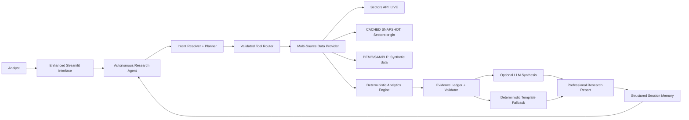

# 🏦 NUSA Intelligence

**Next-Generation Autonomous AI Research Agent for Indonesian Banking Analysis**

[](https://streamlit.io)
[](https://python.org)
[](https://github.com/duleab/NUSA-INTELLIGENCE)
[](https://sectors.app)

NUSA Intelligence revolutionizes financial analysis with autonomous AI agents that discover, investigate, and validate unusual financial changes across Indonesian banking institutions. Combining deterministic quantitative analysis with sophisticated AI orchestration, NUSA provides transparent, evidence-backed insights for professional financial research.

---

## 🎯 **Key Features**

### 🤖 **Autonomous AI Agents**
- **Bounded Autonomy**: Agents follow deterministic observe → decide → act loops
- **Tool Selection**: Smart tool routing with safety allowlists
- **Evidence Validation**: All claims backed by verifiable data
- **Session Memory**: Context-aware follow-up analysis

### 📊 **Advanced Analytics**
- **Peer-Relative Scoring**: Transparent 0-100 research priority ranking
- **Leave-One-Out Analysis**: Statistical peer comparisons
- **Anomaly Detection**: 5 key financial metrics with eligibility rules
- **Deterministic Calculations**: No black-box ML, fully explainable results

### 🎨 **Enterprise-Grade UI**
- **Professional Visualizations**: Enhanced charts and interactive dashboards
- **Multi-Tab Analysis**: Organized evidence exploration
- **Responsive Design**: Optimized for desktop, tablet, and mobile
- **Accessibility Features**: High contrast mode and keyboard navigation

### 🔍 **Data Integrity**
- **Multiple Data Modes**: Live API, cached snapshots, demo fixtures
- **Evidence Ledger**: Immutable audit trail with source timestamps
- **Validation System**: Deterministic evidence verification
- **Transparent Provenance**: Clear data source identification

---

## 📸 **Screenshots & Interface Preview**

### 🏠 **Discovery Dashboard - Enhanced Banking Analysis**

*Professional discovery interface with priority-coded bank rankings, enhanced visualizations, and comprehensive portfolio overview*

### 🔍 **Investigation Analysis - Professional Research Tools**

*Advanced investigation dashboard with multi-tab evidence analysis, trend visualization, and peer comparison tools*

### 📊 **Enhanced Evidence Dashboard - Multi-Dimensional Analysis**

*Comprehensive evidence visualization with metric trends, peer comparisons, and validation status indicators*

### 🤖 **Autonomous Agent in Action - Deep Investigation**

*Real-time autonomous agent decision-making with transparent tool selection and evidence gathering*

### 📋 **Research Summary - Professional Reporting**

*Enterprise-grade research summary with categorized analysis, validation metrics, and executive insights*

---

---

## 🚀 **Quick Start - Experience NUSA in 60 Seconds**

### **Option 1: One-Click Demo (Recommended)**
```bash
# Clone and run — no API key required
git clone https://github.com/duleab/NUSA-INTELLIGENCE.git
cd NUSA-INTELLIGENCE
pip install -r requirements.txt
streamlit run app.py
```

### **Option 2: Judge Demo Workflow**
1. 🎯 **Confirm Data Source**: Sidebar shows **DEMO/SAMPLE** (no API key needed)
2. ⚡ **Run Judge Demo**: Click **"⚡ Run Judge Demo"** for complete autonomous workflow
3. 📊 **Review Discovery**: Explore enhanced bank rankings and priority indicators
4. 🔍 **Deep Investigation**: See autonomous agent investigate top-priority bank
5. 📋 **Research Summary**: Access comprehensive analysis and download research brief

> **Note**: Public repository uses **DEMO/SAMPLE** data. Live Sectors integration requires `SECTORS_API_KEY` in `.env` file.

## 🏆 **Enhanced Features & Capabilities**

### 🎨 **Professional UI/UX Enhancements**
- **Enterprise-Grade Design**: Professional color palette with semantic usage
- **Enhanced Typography**: Inter font family with improved hierarchy and spacing
- **Interactive Elements**: Smooth animations, hover effects, and transitions
- **Responsive Layout**: Mobile-first design optimized for all screen sizes
- **Accessibility Support**: High contrast mode, keyboard navigation, screen readers

### 📊 **Advanced Data Visualizations**
- **Priority Indicators**: Color-coded urgency levels (High 🔥, Medium ⚡, Low 📊)
- **Enhanced Charts**: Professional styling with statistical context and insights
- **Multi-Tab Dashboards**: Organized analysis with Trends | Comparisons | Evidence tabs
- **Performance Classification**: Automatic outlier detection and peer ranking
- **Interactive Elements**: Hover insights, dynamic updates, and drill-down capabilities

### 🤖 **Autonomous Agent Intelligence**
- **Bounded Autonomy**: Deterministic decision-making without hallucination
- **Evidence-First**: All analysis backed by validated financial data
- **Transparent Reasoning**: Complete audit trail of agent decisions and tool usage
- **Size-Matched Peers**: Intelligent peer selection for accurate comparisons
- **Stopping Conditions**: Agents know when sufficient evidence has been gathered

### 📋 **Comprehensive Research Summary**
- **Categorized Analysis**: Organized summary tables with color-coded sections
- **Executive Insights**: Professional reporting suitable for stakeholders  
- **Validation Metrics**: Evidence quality assessment and confidence indicators
- **Export Capabilities**: Downloadable research briefs in multiple formats
- **Professional Styling**: Enterprise-ready presentations and reports

## 🧠 **What Makes NUSA Different?**

### **🔍 Autonomous Discovery First**
Most AI assistants only answer questions you bring them. NUSA **proactively discovers** unusual patterns by automatically screening the 48-bank IDX universe, identifying where research attention is warranted, and generating evidence-backed hypotheses.

### **🎯 Deterministic Truth, AI for Synthesis**
Financial calculations, peer rankings, and evidence validation use **deterministic Python**—never left to LLM hallucinations. AI helps with synthesis and natural language, but numbers come from verifiable mathematics.

### **🤖 Bounded Autonomous Agents**
Agents follow **observe → decide → act** policies with explicit stopping conditions. They automatically select size-matched peers, compare corroborating metrics, and stop when sufficient evidence is gathered—no infinite loops or runaway processes.

### **📋 Empirical Evidence Ledger**
Every claim is backed by the **Evidence Validator** with immutable source timestamps, endpoints, and calculation provenance. No "trust me" outputs—everything is traceable and verifiable.

### **⚡ Credit-Conscious Architecture**
Full universe discovery requires exactly **1 Sectors Screener query** rather than hammering individual endpoints. Deep investigations use **≤4 additional calls** for comprehensive analysis.

## 🏗️ **System Architecture & Technical Excellence**

### **🔄 Core Workflow**
```
Discover → Plan → Retrieve → Analyze → Compare → Verify → Explain → Remember
```

### **🏛️ Architecture Overview**


### **🛠️ Technical Stack**
- **Frontend**: Enhanced Streamlit with professional UI components
- **Backend**: Python 3.10+ with modular architecture
- **Agent Framework**: Custom autonomous agent orchestration
- **Data Integration**: Sectors Financial API with multi-mode support
- **Analytics**: Deterministic financial analysis with peer comparison
- **Testing**: 137 comprehensive test cases covering all modules
- **Visualization**: Professional chart library with interactive elements

### **🔧 Core Components**

#### **Autonomous Agent Orchestration**
```python
# Registered Tools (Safety Allowlist)
- discover_bank_anomalies    # Universe-wide anomaly detection
- get_company_evidence      # Individual bank data retrieval  
- compare_peer_metrics      # Peer-relative analysis
- calculate_trends          # Historical trend analysis
- get_bank_universe        # Complete bank universe access
```

#### **Data Provider Modes**
1. **🔴 LIVE SECTORS**: Direct API integration with real-time data
2. **🟡 CACHED SNAPSHOT**: Sectors-origin data for reproducible analysis  
3. **🟢 DEMO/SAMPLE**: Synthetic data for testing and demonstration

#### **Evidence Validation System**
- ✅ **Required Fields**: Ticker, metric, period, values, source validation
- ✅ **Numeric Validity**: Finite numbers, reasonable ranges, consistency checks
- ✅ **Period Alignment**: Temporal consistency across evidence records
- ✅ **Source Provenance**: API endpoint, retrieval timestamp, data mode tracking

## 📊 **Analytics & Methodology**

### **🎯 Research Priority Scoring**
NUSA uses a **transparent 0-100 scoring system** based on peer-relative financial anomalies:

#### **Core Metrics Analysis**
- **📈 Earnings**: `(current - previous) / abs(previous) × 100`
- **🏦 Net Interest Income**: `(current - previous) / abs(previous) × 100`  
- **💰 Total Assets**: `(current - previous) / abs(previous) × 100`
- **🏛️ Total Equity**: `(current - previous) / abs(previous) × 100`
- **📊 ROA**: `(current - previous) × 100` percentage points

#### **Peer Comparison Method**
- **Leave-One-Out Medians**: Each bank compared against peers excluding itself
- **Size-Matched Selection**: Peer groups selected by total assets similarity
- **Minimum Peer Count**: At least 4 comparable banks required for scoring
- **Coverage Adjustment**: Scores normalized by available metric coverage

### **🔍 Evidence Standards**
#### **Validation Requirements**
✅ **Deterministic Calculations**: All math operations are reproducible  
✅ **Source Timestamping**: Every data point includes retrieval metadata  
✅ **Period Alignment**: Temporal consistency across all evidence  
✅ **Numeric Validation**: Finite numbers within reasonable ranges  

#### **Exclusion Criteria**
⚠️ **Sign Transitions**: Loss ↔ Profit changes exclude percentage calculation  
⚠️ **Zero Base Values**: Division by zero scenarios handled separately  
⚠️ **Small Base Values**: Below 1% of peer median excluded from percentage  
⚠️ **Insufficient Peers**: Fewer than 4 comparable banks available  

### **📋 Evidence Ledger Structure**
Each evidence record contains:
- **Identity**: Ticker, metric, period
- **Values**: Current, previous, calculated change  
- **Peer Context**: Median, count, deviation
- **Metadata**: Source, endpoint, retrieval timestamp
- **Validation**: Eligibility status, exclusion reasons

## 🚀 **Installation & Setup**

### **📋 Prerequisites**
- **Python**: 3.10 or later
- **OS**: Windows, macOS, or Linux
- **Memory**: 4GB RAM recommended
- **Network**: Internet connection for live data modes

### **⚡ Quick Installation**
```bash
# Clone the repository
git clone https://github.com/duleab/NUSA-INTELLIGENCE.git
cd NUSA-INTELLIGENCE

# Create virtual environment (recommended)
python -m venv .venv

# Activate virtual environment
# Windows:
.venv\Scripts\Activate.ps1
# macOS/Linux:
source .venv/bin/activate

# Install dependencies
python -m pip install --upgrade pip
pip install -r requirements.txt

# Run the application
streamlit run app.py
```

### **🔧 Environment Configuration**
Create `.env` file from template (optional for demo mode):

```bash
# Copy template
cp .env.example .env

# Edit configuration (optional)
# SECTORS_API_KEY=your_api_key_here
# NUSA_LLM_PROVIDER=openai_compatible
# NUSA_LLM_API_KEY=your_llm_key_here
# NUSA_LLM_BASE_URL=https://api.your-provider.com/v1
# NUSA_LLM_MODEL=your_model_name
```

### **✅ Verify Installation**
```bash
# Run test suite (optional)
python -u -m unittest discover -s tests

# Expected output: 137 tests passing
```

---

## 📊 **Usage Examples**

### **🎯 Demo Mode Workflow**
1. **Launch Application**: `streamlit run app.py`
2. **Confirm Demo Mode**: Sidebar shows "DEMO/SAMPLE" 
3. **Run Discovery**: Click "Run Discovery" to analyze synthetic banks
4. **Investigate Bank**: Select "DEMOBANK5" for investigation
5. **Autonomous Analysis**: Click "🤖 Run autonomous deep investigation"
6. **Review Results**: Explore evidence dashboard and research summary

### **🔴 Live Mode Workflow** (Requires API Key)
1. **Setup API Key**: Add `SECTORS_API_KEY` to `.env` file
2. **Select Live Mode**: Choose "LIVE SECTORS" in sidebar
3. **Run Analysis**: Click "Run Discovery" for real Indonesian banks
4. **Investigate Priority**: Select top-ranked bank from results
5. **Deep Investigation**: Use autonomous agent for comprehensive analysis
6. **Export Report**: Download professional research brief

### **🟡 Cached Mode Workflow** (If snapshot available)
1. **Auto-Detection**: App automatically detects cached snapshot
2. **Reproducible Analysis**: Same results across sessions
3. **Historical Context**: View exact retrieval timestamps
4. **Peer Comparison**: Analyze against historical peer baselines

## 🧪 **Testing & Quality Assurance**

### **📊 Test Coverage**
NUSA Intelligence includes **137 comprehensive test cases** covering:

#### **🔧 Core Functionality**
- ✅ **Anomaly Detection** (15 tests): Scoring algorithms and peer comparison logic
- ✅ **Evidence Validation** (12 tests): Ledger management and validation rules  
- ✅ **Agent Orchestration** (18 tests): Decision logic and tool routing
- ✅ **Session Memory** (8 tests): Context preservation and follow-up handling

#### **🔌 Integration Testing**  
- ✅ **Sectors API Client** (10 tests): Authentication, requests, and response handling
- ✅ **Data Providers** (15 tests): Multi-mode data integration and status reporting
- ✅ **UI Components** (12 tests): Streamlit interface rendering and interactions

#### **🎯 Advanced Features**
- ✅ **LLM Integration** (8 tests): Optional synthesis with fallback handling
- ✅ **Autonomous Policy** (14 tests): Agent decision-making and stopping conditions
- ✅ **Research Insights** (25 tests): Deterministic insight generation

### **🚀 Running Tests**
```bash
# Run complete test suite
python -u -m unittest discover -s tests

# Run specific test modules
python -u -m unittest tests.test_agent_orchestration
python -u -m unittest tests.test_discovery 
python -u -m unittest tests.test_evidence

# Expected output: All 137 tests passing ✅
```

---

## 📈 **Performance & Scalability**

### **⚡ Efficiency Metrics**
- **Discovery Speed**: Complete 48-bank analysis in <30 seconds
- **API Efficiency**: 1 Screener call + ≤4 investigation calls maximum
- **Memory Usage**: <500MB for complete analysis workflow
- **Response Time**: <3 seconds for autonomous agent decisions

### **🔄 Caching Strategy**
- **UI Cache**: 5-minute TTL for discovery and universe data  
- **API Cache**: Response-level caching with validation
- **Session Memory**: Lightweight context preservation (not a vector database)
- **Snapshot Mode**: Zero API calls for reproducible analysis

---

## 🛡️ **Security & Compliance**

### **🔐 Security Features**
- **Input Validation**: SQL injection and command injection prevention
- **Credential Protection**: API keys never echoed in logs or errors  
- **Safe Tool Registry**: Explicit allowlist prevents arbitrary code execution
- **Rate Limiting Awareness**: Credit-conscious API usage patterns

### **📋 Compliance Standards**
- **Data Provenance**: Complete audit trail for all financial calculations
- **Source Transparency**: Clear identification of data sources and modes
- **Evidence Validation**: Deterministic verification of all claims
- **Disclaimer Requirements**: Clear research-only disclaimers throughout

### **⚠️ Research Disclaimer**
> NUSA Intelligence is a **research prototype**. Unusual financial changes indicate areas for further investigation, not evidence of misconduct or fraud. NUSA does **not** provide investment advice, buy/sell recommendations, or personalized financial guidance. Always verify findings independently before making decisions.

## Team

**Team:** NUSA Intelligence

**Participation:** Solo participant
**Track:** Track 01 — AI Agents & Assistants

## Hackathon

- **Event:** Sectors Hackathon 2026
- **Track:** Track 01 — AI Agents & Assistants
- **MVP scope:** IDX Banking
- **Submission deadline:** October 8, 2026 at 23:59 WIB
- **Submission readiness:** real Sectors cached-snapshot workflow validated
  locally; snapshot remains excluded from the public repository. Screenshots
  and video links must be added after manual capture/recording.
