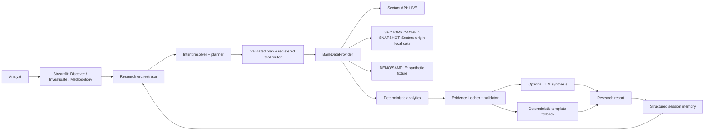

# NUSA Intelligence

**Autonomous AI research agent for unusual financial changes in Indonesian listed companies.**

The current MVP focuses on Indonesian-listed banks. NUSA combines deterministic
quantitative analysis with custom AI-agent orchestration and an evidence ledger.
It supports three explicit data modes: **LIVE SECTORS DATA**, **SECTORS CACHED
SNAPSHOT**, and **DEMO/SAMPLE**. The local judging environment uses a clearly
identified Sectors-origin cached snapshot; it is not a live refresh. The raw
snapshot is intentionally excluded from the public repository.

## Problem

Analysts have access to large amounts of financial data, but identifying which
companies deserve investigation and why requires repetitive screening,
historical analysis, and peer comparison. A fluent AI summary without
verifiable evidence can also make unsupported financial claims.

## Solution

NUSA combines the authenticated Sectors Financial API, deterministic
quantitative analytics, and custom AI-agent orchestration to discover unusual
financial changes and investigate them. Python calculates the metrics; the
optional LLM helps resolve unsupported request wording and synthesize validated
evidence. A local Sectors-origin snapshot supports stable judging, while an
explicit fictional fixture remains available when Sectors data is unavailable.
The application never silently switches between source modes.

## Why NUSA

- Discovery is limited to a defined banking universe rather than claiming to
  continuously scan every IDX company.
- Rankings are explainable: the metric, period, change, peer median, peer count,
  and deviation can be traced in the evidence ledger.
- The orchestration and allowed tools are implemented in the project, rather
  than delegated to a prompt-only chatbot.
- Missing coverage stays missing. Demo data is visibly labeled and is never
  presented as current Sectors market data.

## Track 01 Qualification

NUSA is **not simply an LLM connected to Sectors**. It implements custom intent
resolution, research planning, registered tool routing, deterministic
analytics, anomaly scoring, an Evidence Ledger, evidence validation, optional
LLM synthesis, and structured session memory. Python controls data retrieval,
calculations, validation, and tool execution. The LLM does not originate
financial values or execute generated code. A deterministic report template
works without an LLM credential.

## Architecture



The product flow is:

**Discover → Plan → Retrieve → Analyze → Compare → Verify → Explain → Remember**

The interface calls the existing provider and orchestrator; it does not
duplicate financial calculations. Operational trace events are visible without
exposing hidden chain-of-thought.

## Core Workflow

- **Discover:** rank eligible unusual annual metric changes in a bounded bank
  universe.
- **Plan:** resolve DISCOVER, INVESTIGATE, or COMPARE and validate a structured
  plan against registered tools.
- **Retrieve:** use the selected provider; live errors propagate, and fixture
  data is used only when DEMO/SAMPLE is explicitly selected.
- **Analyze / Compare:** compute deterministic changes and same-universe peer
  baselines where the data supports them.
- **Verify:** require source-backed, period-aligned evidence before synthesis.
- **Explain / Remember:** produce an evidence-grounded report and store only
  small structured context for an in-session follow-up.

## Custom Agent Orchestration

The Python orchestrator supports `DISCOVER`, `INVESTIGATE`, and `COMPARE`.
Deterministic parsing and fixed plan templates are used first. If request
wording cannot be resolved, an optional model may propose a structured plan;
the plan must still pass schema, ticker-consistency, intent, and registered-tool
validation. Only explicitly registered tools can run:

- `discover_bank_anomalies`
- `get_company_evidence`
- `compare_peer_metrics`
- `calculate_trends`
- `get_bank_universe`

Operational progress is exposed without hidden chain-of-thought. Session memory
stores only the active ticker and sector, last investigation objective and
anomaly metric, selected peers, evidence IDs, and previous plan. It is
session-local and is not a vector database or durable store.

## Sectors Integration

NUSA has three distinct modes:

1. **LIVE SECTORS DATA** — the authenticated Sectors client retrieves data
   directly from `GET /v2/companies/`. Live API errors are surfaced; no fixture
   substitution occurs.
2. **SECTORS CACHED SNAPSHOT** — previously retrieved Sectors-origin data is
   read locally for reproducible analysis. The status shows its original
   retrieval time and explicitly says it is not a live refresh.
3. **DEMO/SAMPLE** — fictional banking companies and synthetic values for users
   without Sectors credentials. These values are never represented as Sectors
   data or current market data.

The successful Companies Screener query returned **48 IDX Banks** and 2024/2025
annual values for **earnings, net interest income, total assets, total equity,
and ROA**. The judging environment uses a local Sectors-origin cached snapshot
for stability. The raw financial snapshot is intentionally ignored by Git and
excluded from the public repository; a repository clone does not contain this
dataset.

To populate a local snapshot with authorized Sectors access, set
`SECTORS_API_KEY` in the ignored `.env`, make an authorized Screener request,
save only its JSON response body (never headers or credentials) under the
ignored `data/cache/sectors/` directory, then use the validated importer in
[`docs/sectors_snapshot_ingestion.md`](docs/sectors_snapshot_ingestion.md).
Record the original timezone-aware retrieval time and exact query. The importer
creates a provenance envelope at
`data/cache/sectors/banks_companies_screener.json` by default. The live provider
and cached provider remain separate. See
[`docs/sectors_api_analysis.md`](docs/sectors_api_analysis.md) for integration
history and field analysis.

## Methodology

Real Sectors scoring uses annual earnings, net interest income, total assets,
total equity, and ROA; NIM is excluded from the initial real-data workflow.
Earnings, net interest income, assets, and equity use
`(current - previous) / abs(previous) × 100`. ROA is stored as a decimal
fraction and uses `(current - previous) × 100` percentage points. A sign
transition, zero prior value, or prior value below 1% of the median absolute
valid prior-year value is excluded from percentage-based scoring and explicitly
flagged with its absolute monetary change. No values are imputed.

Eligible metrics use leave-one-out peer medians, peer-relative deviation, and
percentile contributions. The 0–100 research-priority composite is adjusted by
eligible-metric coverage; a missing or ineligible metric is not assigned a zero
contribution. At least four comparable companies are required for a metric.
This is a deterministic, transparent ranking: **no black-box ML anomaly model
is used**. The score is not investment advice, a BUY/SELL signal, or a
misconduct/fraud assessment.

The separate DEMO/SAMPLE fixture contains five fictional `DEMOBANK` companies
with synthetic annual metrics. Those values are not Sectors data and do not
describe real companies.

## Evidence Grounding

The Evidence Ledger records the ticker, metric, current and previous values,
change, peer median/count, deviation, period, source, endpoint, retrieval time,
calculation, and data mode where available. The validator checks required
fields, ticker/period compatibility, numeric validity, and source provenance.
Only validated ledger records are sent to the optional LLM synthesizer. The
synthesis prompt prohibits invented values, investment recommendations, and
personalized advice; it requires limitations, evidence IDs, and a distinction
between anomalies and misconduct. Invalid references or unsupported numeric
claims fall back to a deterministic evidence-based summary.

## Screenshots

Screenshots are to be captured manually; none are claimed as included yet. See
[`docs/screenshots.md`](docs/screenshots.md) for the real cached-data shot list,
crop guidance, and captions. Keep **SECTORS CACHED SNAPSHOT — Sectors-origin
data — Not a live refresh** visible on real-data screenshots. DEMO/SAMPLE
screenshots must retain their separate synthetic-data warning.

## Installation

Python 3.10 or later is required.

```powershell
python -m venv .venv
.venv\Scripts\Activate.ps1
python -m pip install --upgrade pip
python -m pip install -r requirements.txt
```

## Environment Variables

Copy `.env.example` to `.env` for local configuration. `.env` is ignored by
Git. Leave optional LLM variables empty to use deterministic template reports.

| Variable | Required | Purpose |
| --- | --- | --- |
| `SECTORS_API_KEY` | Live mode only | Sectors API authorization. |
| `NUSA_LLM_PROVIDER` | No | Currently `openai_compatible`. |
| `NUSA_LLM_API_KEY` | No | Optional model-provider credential. |
| `NUSA_LLM_BASE_URL` | When LLM key is set | HTTPS base URL for the compatible API. |
| `NUSA_LLM_MODEL` | When LLM key is set | Provider model identifier. |

Use placeholders in `.env.example`; never paste a real key into source,
screenshots, test output, or Git.

## Running Locally

```powershell
streamlit run app.py
```

If the validated local Sectors snapshot exists, the app defaults to **SECTORS
CACHED SNAPSHOT** for a reproducible demo. Otherwise, choose **LIVE SECTORS** or
**DEMO/SAMPLE** explicitly; the app reports that no cached dataset is present
and does not substitute one. Live API failures are surfaced. The UI caches
discovery and universe reads for five minutes, while the existing Sectors
client retains its own response-cache behavior.

Run the test suite with:

```powershell
python -u -m unittest discover -s tests
```

## Tests

The repository's current full suite contains 92 tests. Run the command above
from the project root before recording or submitting.

## Sectors Cached-Snapshot Demo

1. Confirm the badge says **SECTORS CACHED SNAPSHOT** and the notice identifies
   Sectors-origin data and says **Not a live refresh**.
2. In **DISCOVER**, click **Analyze Banks**. The snapshot contains 48 IDX Banks;
   `SUPA.JK` is the highest research priority in this validated snapshot.
3. Investigate `SUPA.JK`. Its primary signal is net interest income **+159.75%**
   against a peer median of approximately **+1.69%**. Review the research plan,
   tool execution, evidence ledger, validation, and report.
4. Ask **Compare this change with BBSI.JK and BBHI.JK**. Memory resolves the
   metric to net interest income: SUPA **+159.75%**, BBSI **+91.97%**, BBHI
   **+28.93%**.
5. Open **METHODOLOGY** for formulas, source modes, limitations, and disclaimer.

The exact underlying retrieval timestamp appears in the app. A cached snapshot
is reproducible Sectors-origin data, not a live market refresh.

## DEMO/SAMPLE Fallback

Choose **DEMO/SAMPLE** only when the fictional fixture is desired. Confirm the
warning **DEMO/SAMPLE DATA — Synthetic demonstration values. Not current market
data.** The bundled fixture contains `DEMOBANK1`–`DEMOBANK5`; it remains fully
separate from the Sectors snapshot.

The bundled fixture contains five fictional `DEMOBANK1`–`DEMOBANK5` symbols and
synthetic annual values for 2022–2025 (revenue, earnings, assets, equity, ROA,
and ROE). Its numeric values are demonstration data, not current market values
or Sectors data. `DEMOBANK5` is configured as an intentionally unusual sample
for the guided Discovery → Investigate → peer comparison journey.

## Known Limitations

- The judging snapshot is cached and does not refresh live. Its raw financial
  file is intentionally excluded from Git; repository clones do not include it.
- LIVE mode requires authorized Sectors credentials and depends on API
  availability. Errors are surfaced without fallback.
- The separate DEMO/SAMPLE fixture remains synthetic and cannot support claims
  about real companies or current market values.
- Historical coverage and available metrics depend on the provider response.
  The application abstains when required peer/history evidence is insufficient.
- LLM synthesis and unresolved-request interpretation require a configured
  compatible provider; offline template summaries remain available.
- Session memory lasts only for the active Streamlit session.
- The app does not establish causality, detect fraud, trade securities, or
  provide full-market or long-horizon technical surveillance.

## Safety / Research Disclaimer

NUSA is a research prototype. An unusual financial change is a prompt for
further investigation, not evidence of misconduct or fraud. NUSA does not issue
BUY/SELL recommendations or provide personalized investment advice. Verify
source, period, coverage, and context independently before making decisions.

## Team

**Team:** NUSA Intelligence

**Participation:** Solo participant
**Track:** Track 01 — AI Agents & Assistants

## Hackathon

- **Event:** Sectors Hackathon 2026
- **Track:** Track 01 — AI Agents & Assistants
- **MVP scope:** IDX Banking
- **Submission deadline:** October 8, 2026 at 23:59 WIB
- **Submission readiness:** real Sectors cached-snapshot workflow validated
  locally; snapshot remains excluded from the public repository. Screenshots
  and video links must be added after manual capture/recording.
