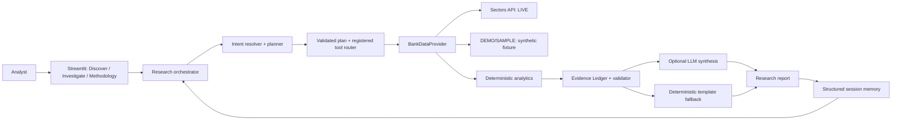

# NUSA Intelligence

**Autonomous AI research agent for unusual financial changes in Indonesian listed companies.**

The current MVP focuses on Indonesian-listed banks. NUSA combines deterministic
quantitative analysis with custom AI-agent orchestration and an evidence ledger.
The judging journey uses visibly labeled synthetic DEMO/SAMPLE data. Direct
application access to Sectors' Companies Screener remains unresolved; see
[Known Limitations](#known-limitations).

## Problem

Analysts have access to large amounts of financial data, but identifying which
companies deserve investigation and why requires repetitive screening,
historical analysis, and peer comparison. A fluent AI summary without
verifiable evidence can also make unsupported financial claims.

## Solution

NUSA combines a live-capable Sectors data-provider integration, deterministic
quantitative analytics, and custom AI-agent orchestration to discover unusual
financial changes and investigate them. Python calculates the metrics; the
optional LLM helps resolve unsupported request wording and synthesize validated
evidence. When the live Screener is unavailable, the demo uses an explicit
synthetic fixture, never a silent live-to-demo substitution.

## Why NUSA

- Discovery is limited to a defined banking universe rather than claiming to
  continuously scan every IDX company.
- Rankings are explainable: the metric, period, change, peer median, peer count,
  and deviation can be traced in the evidence ledger.
- The orchestration and allowed tools are implemented in the project, rather
  than delegated to a prompt-only chatbot.
- Missing coverage stays missing. Demo data is visibly labeled and is never
  presented as current Sectors market data.

## Track 01 Qualification

NUSA is **not simply an LLM connected to Sectors**. It implements custom intent
resolution, research planning, registered tool routing, deterministic
analytics, anomaly scoring, an Evidence Ledger, evidence validation, optional
LLM synthesis, and structured session memory. Python controls data retrieval,
calculations, validation, and tool execution. The LLM does not originate
financial values or execute generated code. A deterministic report template
works without an LLM credential.

## Architecture



The product flow is:

**Discover → Plan → Retrieve → Analyze → Compare → Verify → Explain → Remember**

The interface calls the existing provider and orchestrator; it does not
duplicate financial calculations. Operational trace events are visible without
exposing hidden chain-of-thought.

## Core Workflow

- **Discover:** rank eligible unusual annual metric changes in a bounded bank
  universe.
- **Plan:** resolve DISCOVER, INVESTIGATE, or COMPARE and validate a structured
  plan against registered tools.
- **Retrieve:** use the selected provider; live errors propagate, and fixture
  data is used only when DEMO/SAMPLE is explicitly selected.
- **Analyze / Compare:** compute deterministic changes and same-universe peer
  baselines where the data supports them.
- **Verify:** require source-backed, period-aligned evidence before synthesis.
- **Explain / Remember:** produce an evidence-grounded report and store only
  small structured context for an in-session follow-up.

## Custom Agent Orchestration

The Python orchestrator supports `DISCOVER`, `INVESTIGATE`, and `COMPARE`.
Deterministic parsing and fixed plan templates are used first. If request
wording cannot be resolved, an optional model may propose a structured plan;
the plan must still pass schema, ticker-consistency, intent, and registered-tool
validation. Only explicitly registered tools can run:

- `discover_bank_anomalies`
- `get_company_evidence`
- `compare_peer_metrics`
- `calculate_trends`
- `get_bank_universe`

Operational progress is exposed without hidden chain-of-thought. Session memory
stores only the active ticker and sector, last investigation objective and
anomaly metric, selected peers, evidence IDs, and previous plan. It is
session-local and is not a vector database or durable store.

## Sectors Integration

The live provider uses the authenticated Sectors client and the structured
Companies Screener (`GET /v2/companies/`); it does not silently switch to demo
data on an API error. The app also supports the taxonomy endpoint
(`/v2/subsectors/`) and company-report retrieval through the existing client.
API credentials are read from the environment or ignored `.env`, never shown in
the interface or committed.

**Current integration status:** authenticated `/v2/subsectors/` access was
confirmed. The official Sectors Companies Screener Playground was reported to
return the IDX Banks universe (48 companies). That Playground result is not an
application response. Direct application `GET /v2/companies/` currently returns
**HTTP 403**, and the cause remains unresolved. The application retains the
LIVE provider architecture and propagates this error without switching to
DEMO/SAMPLE. Consequently the submission journey uses the explicitly labeled
synthetic fixture; its values are **not current market data**. See
[`docs/sectors_api_analysis.md`](docs/sectors_api_analysis.md) for the API
investigation.

## Methodology

The anomaly engine only considers annual metric pairs actually present in its
input. For each eligible metric it calculates year-over-year percentage
change, compares a bank against the median change of its other comparable
banks, and ranks absolute deviations by cross-sectional percentile. It
withholds a score unless at least four companies (the subject plus three peers)
have comparable values. The score indicates **research priority**; it is not a
prediction, investment rating, fraud signal, or causal claim.

Annual fields requested from the Screener are documented candidates, not
confirmed live coverage. The bundled fixture contains five fictional
`DEMOBANK1`–`DEMOBANK5` companies with synthetic 2022–2025 revenue, earnings,
assets, equity, ROA, and ROE values in demonstration units. These values are
not Sectors data and do not describe real companies.

## Evidence Grounding

The Evidence Ledger records the ticker, metric, current and previous values,
change, peer median/count, deviation, period, source, endpoint, retrieval time,
calculation, and data mode where available. The validator checks required
fields, ticker/period compatibility, numeric validity, and source provenance.
Only validated ledger records are sent to the optional LLM synthesizer. The
synthesis prompt prohibits invented values, investment recommendations, and
personalized advice; it requires limitations, evidence IDs, and a distinction
between anomalies and misconduct. Invalid references or unsupported numeric
claims fall back to a deterministic evidence-based summary.

## Screenshots

Screenshots are to be captured manually; none are claimed as included yet. See
[`docs/screenshots.md`](docs/screenshots.md) for the shot list, crop guidance,
and captions. Every sample-data screenshot must retain its prominent warning.

## Installation

Python 3.10 or later is required.

```powershell
python -m venv .venv
.venv\Scripts\Activate.ps1
python -m pip install --upgrade pip
python -m pip install -r requirements.txt
```

## Environment Variables

Copy `.env.example` to `.env` for local configuration. `.env` is ignored by
Git. Leave optional LLM variables empty to use deterministic template reports.

| Variable | Required | Purpose |
| --- | --- | --- |
| `SECTORS_API_KEY` | Live mode only | Sectors API authorization. |
| `NUSA_LLM_PROVIDER` | No | Currently `openai_compatible`. |
| `NUSA_LLM_API_KEY` | No | Optional model-provider credential. |
| `NUSA_LLM_BASE_URL` | When LLM key is set | HTTPS base URL for the compatible API. |
| `NUSA_LLM_MODEL` | When LLM key is set | Provider model identifier. |

Use placeholders in `.env.example`; never paste a real key into source,
screenshots, test output, or Git.

## Running Locally

```powershell
streamlit run app.py
```

The app starts in DEMO/SAMPLE mode. Select **LIVE — Sectors** explicitly to use
the configured API. Live API failures are surfaced; no fixture substitution is
performed. The UI caches discovery and universe reads for five minutes, while
the existing Sectors client retains its own response-cache behavior.

Run the test suite with:

```powershell
python -m unittest discover -s tests -v
```

## Tests

The repository's current full suite contains 59 tests. Run the command above
from the project root before recording or submitting.

## Demo Mode

1. Keep the source selector on **DEMO/SAMPLE** and confirm the warning:
   **Synthetic demonstration values. Not current market data.**
2. In **DISCOVER**, click **Example: Find unusual financial changes among
   Indonesian banks**; this runs Discovery (or click **Analyze Banks**).
3. Click **Investigate highest-ranked demo bank** to preselect `DEMOBANK5`.
   Open **INVESTIGATE** and click **Run investigation** to see the plan, tools,
   deterministic analysis, evidence validation, and report.
4. Click the example prompt **Compare this change with DEMOBANK2 and DEMOBANK3**
   and then **Run follow-up peer comparison**. Session memory resolves “this
   change” to the investigation's primary-driver metric and compares the three
   fictional banks using fixture evidence.
5. Open **METHODOLOGY** for scoring, evidence, agent, and disclaimer details.

The bundled fixture contains five fictional `DEMOBANK1`–`DEMOBANK5` symbols and
synthetic annual values for 2022–2025 (revenue, earnings, assets, equity, ROA,
and ROE). Its numeric values are demonstration data, not current market values
or Sectors data. `DEMOBANK5` is configured as an intentionally unusual sample
for the guided Discovery → Investigate → peer comparison journey.

## Known Limitations

- Direct live `GET /v2/companies/` access from the Python client remains HTTP
  403, despite the reported successful Playground query. Live Discover,
  Investigate, and Compare therefore remain unverified end to end.
- The bundled DEMO/SAMPLE fixture is small, fictional, and uses synthetic
  2022–2025 demonstration values. It demonstrates the orchestration workflow
  but cannot demonstrate real BBRI/BBCA/BMRI financial data or a live-market
  conclusion.
- Historical financial coverage and available metrics depend on the provider
  response. The application abstains when required peer/history evidence is
  insufficient.
- LLM synthesis and unresolved-request interpretation require a configured
  compatible provider; offline template summaries remain available.
- Session memory lasts only for the active Streamlit session.
- The app does not establish causality, detect fraud, trade securities, or
  provide full-market or long-horizon technical surveillance.

## Safety / Research Disclaimer

NUSA is a research prototype. An unusual financial change is a prompt for
further investigation, not evidence of misconduct or fraud. NUSA does not issue
BUY/SELL recommendations or provide personalized investment advice. Verify
source, period, coverage, and context independently before making decisions.

## Team

**Team:** NUSA Intelligence

**Participation:** Solo participant
**Track:** Track 01 — AI Agents & Assistants

## Hackathon

- **Event:** Sectors Hackathon 2026
- **Track:** Track 01 — AI Agents & Assistants
- **MVP scope:** IDX Banking
- **Submission deadline:** September 30, 2026 at 23:59 WIB
- **Submission readiness:** local repository prepared; live Companies Screener
  access remains outstanding. Screenshots and video links must be added after
  manual capture/recording.
